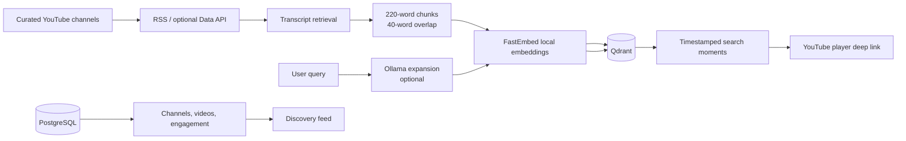

# YouTube Semantics

> A local-first semantic discovery layer for curated YouTube channels.

YouTube Semantics indexes timestamped video transcripts and retrieves the exact moments that answer an idea, question, or mechanism—not merely videos whose titles happen to match a keyword. A search for `yoga for anxiety`, for example, can surface a neuroscience segment about stress regulation and link directly to that point in the source video.

The project is deliberately designed to run without paid AI APIs. It uses local embeddings, optional local query expansion, public YouTube channel feeds, PostgreSQL, and Qdrant.

## What it does

- Maintains a whitelist of YouTube channels.
- Discovers recent videos through public YouTube RSS feeds. A YouTube Data API key is optional, never required.
- Retrieves available captions, breaks them into overlapping timestamped chunks, and records each source moment.
- Creates semantic embeddings locally with `BAAI/bge-small-en-v1.5` through FastEmbed's ONNX runtime.
- Stores chunks in Qdrant for cosine-similarity search.
- Optionally expands queries through a locally running Ollama model; search still works when Ollama is unavailable.
- Records positive and negative engagement signals and exposes a relevance-first discovery feed.
- Includes a small browser UI plus interactive API documentation.

## Architecture



## Requirements

- Docker Desktop with at least 4 GB memory available to Docker.
- Python 3.12+ only if running the API outside Docker.
- [Ollama](https://ollama.com) is optional. It improves query expansion but is not required for search.

No OpenAI account or paid API key is needed.

> **Disk note:** Docker images and local AI models can use several GB. Check available storage before building. The project itself is small; the storage is consumed by Docker's Linux VM and optional models.

## Quick start with Docker

```powershell
git clone https://github.com/YOUR-ACCOUNT/yt-semantics.git
cd yt-semantics
Copy-Item .env.example .env
docker compose up --build
```

Open these URLs once the services are healthy:

| Surface | URL |
| --- | --- |
| Discovery interface | http://localhost:8000/ |
| Interactive API docs | http://localhost:8000/docs |
| Health check | http://localhost:8000/health |
| Qdrant dashboard | http://localhost:6333/dashboard |

If you want local query expansion, install Ollama and pull the small default model:

```powershell
ollama pull qwen2.5:3b
```

The Docker service reaches Ollama through `host.docker.internal` on Windows and macOS. If you run the API directly on your host, set `OLLAMA_URL=http://localhost:11434` instead.

## First indexing run

1. Open http://localhost:8000/docs.
2. Use `POST /channels` to add a channel. The value must be the channel ID, such as `UC...`, not a handle or display name.
3. Copy the returned numeric `id`.
4. Run `POST /ingestion/channels/{channel_id}` with that numeric ID.
5. Search in the browser interface or call `POST /search`.

Example channel request:

```json
{
  "youtube_channel_id": "UCsXVk37bltHxD1rDPwtNM8Q",
  "name": "Kurzgesagt – In a Nutshell"
}
```

Each result contains `timestamp_seconds`. The UI builds a YouTube link using that timestamp, taking the viewer directly to the relevant moment.

## Configuration

Copy `.env.example` to `.env`. The defaults work for Docker and need no secrets.

| Variable | Default | Purpose |
| --- | --- | --- |
| `DATABASE_URL` | Docker PostgreSQL URL | Relational metadata and engagement storage |
| `QDRANT_URL` | `http://qdrant:6333` | Vector database endpoint |
| `QDRANT_COLLECTION` | `video_chunks_local` | Vector collection name |
| `EMBEDDING_MODEL` | `BAAI/bge-small-en-v1.5` | Local embedding model |
| `EMBEDDING_DIMENSIONS` | `384` | Must match the selected embedding model |
| `OLLAMA_URL` | `http://host.docker.internal:11434` | Optional local Ollama endpoint |
| `OLLAMA_MODEL` | `qwen2.5:3b` | Optional local expansion model |
| `YOUTUBE_API_KEY` | blank | Optional API fallback; RSS remains the default |

When the first transcript is indexed or the first search runs, the embedding model downloads once and is cached locally.

## API map

| Method | Endpoint | Purpose |
| --- | --- | --- |
| `GET` | `/health` | Liveness check |
| `POST` | `/channels` | Add a curated channel |
| `GET` | `/channels` | List curated channels |
| `POST` | `/ingestion/channels/{id}` | Discover and index recent videos |
| `POST` | `/search` | Semantic search of indexed transcript chunks |
| `POST` | `/interactions` | Record `watched` or `not_interested` feedback |
| `GET` | `/feed/{user_id}` | Generate a relevance-first discovery feed |

### Search request

```json
{
  "query": "how does exercise reduce anxiety?",
  "limit": 12
}
```

### Engagement request

```json
{
  "user_id": "demo-user",
  "video_id": 1,
  "kind": "watched",
  "watch_seconds": 90
}
```

Watched videos at 60 seconds or more reinforce a user's interest vector. `not_interested` events reduce it. The feed endpoint deduplicates source videos so one video does not crowd the whole page.

## Scheduled ingestion

Run the worker daily with your platform scheduler or Windows Task Scheduler:

```powershell
docker compose exec api python -m app.worker
```

The worker reuses the channel whitelist and skips videos already marked as indexed.

## Transcript and content limitations

- Public captions are not guaranteed. Videos without an available transcript are saved as `transcript_unavailable`.
- The included transcript package is an unofficial integration and may be rate-limited or affected by upstream YouTube changes.
- `requirements-transcription.txt` provides optional local `faster-whisper` support for media you are authorized to process. This project intentionally does not download third-party audio automatically.
- Follow YouTube's terms, creator rights, and applicable law when indexing or publishing material.

## Development without Docker

This is practical for API development, but Qdrant must still be available separately:

```powershell
python -m venv .venv
.\.venv\Scripts\Activate.ps1
pip install -r requirements.txt
uvicorn app.main:app --reload
```

Set `DATABASE_URL=sqlite:///./yt_semantics.db` and `QDRANT_URL=http://localhost:6333` in `.env` if you prefer SQLite for development.

Run the tests with:

```powershell
python -m pytest tests -q
```

## Production notes

For a public deployment, separate the API, scheduled ingestion, and any transcription worker. Use managed PostgreSQL/Qdrant or provision persistent volumes, protect admin ingestion endpoints with authentication, apply rate limiting, and monitor transcript failures and vector-index growth.

## Project status

This is an early working foundation aimed at experimentation and curated, small-to-medium channel rosters. Authentication, multi-tenant authorization, production queues, rich reranking, and a proper profile-vector store are the natural next steps.

## License

No license has been selected yet. Add one before accepting outside contributions or publishing derivative work under a specific set of terms.
